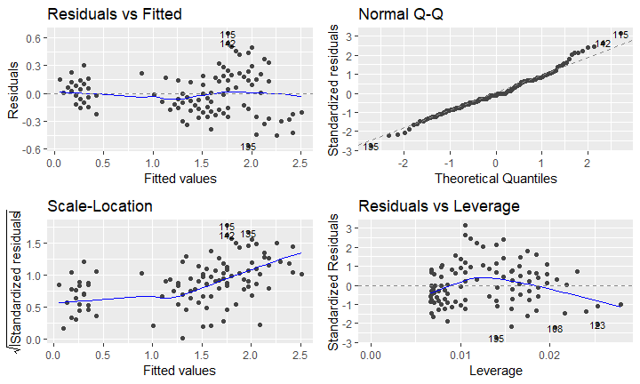

## R Markdown

This is an TBA presentation. Markdown is a simple formatting syntax for authoring HTML, PDF, and MS Word documents. For more details on using R Markdown see <http://rmarkdown.rstudio.com>.

When you click the **Knit** button a document will be generated that includes both content as well as the output of any embedded R code chunks within the document.

## Slide with Bullets

- Bullet 1
- Bullet 2
- Bullet 3

## Slide with R Output


```r
head(cars)
```

```
## # A tibble: 6 x 2
##   speed  dist
## * <dbl> <dbl>
## 1     4     2
## 2     4    10
## 3     7     4
## 4     7    22
## 5     8    16
## 6     9    10
```

## Bias-Variance Tradeoff

$$y = ax+b+e$$
where $y$ is the response variable...

## Slide with Plot {.smaller}


```r
autoplot(lm(Petal.Width ~ Petal.Length, data = iris), label.size = 3)
```

<!-- -->

## New Slide


